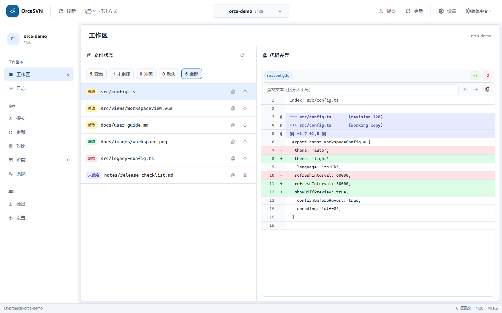

# OrcaSVN

简体中文 | [繁體中文](README.zh-TW.md) | [English](README.en.md) | [日本語](README.ja.md) | [한국어](README.ko.md)

OrcaSVN 是一个基于 Tauri、Rust 和 Vue 3 的跨平台 SVN 桌面客户端。它借鉴 Git 客户端清晰的工作区体验，同时保留 SVN 的集中式版本控制语义。



当前 0.6.2 开发界面，2026-10-02 截取；使用示例工作区数据，正式发行版可能略有差异。[深色主题](docs/images/orcasvn-workspace-dark.png)。

## 核心能力

- 以类似 `git status` 的分类查看本地变更、未版本文件、冲突和缺失文件
- 检出、更新、按文件或目录选择提交、加入版本控制、还原和清理工作副本
- 本地贮藏：按文件或文本分块保存修改，并恢复到原工作区
- 查看提交历史、文件差异和逐行 Blame
- 支持简体中文、繁体中文、英语、日语和韩语
- 支持浅色、深色主题以及 Windows、macOS、Linux

> OrcaSVN 调用本机的 `svn` 命令行工具，不会自行实现 SVN 协议。

Switch、Merge、Resolve 和受控文件安排删除目前需使用其他 SVN 客户端或命令行完成，再回到 OrcaSVN 刷新。工作区中的“删除”按钮用于删除未跟踪的本地文件。

## 安装

### Windows

```powershell
winget install OrcaSVN.OrcaSVN
```

也可以从 [GitHub Releases](https://github.com/wustites/OrcaSVN/releases) 下载 Windows、macOS 或 Linux 安装包。

安装后请确认 SVN CLI 可用：

```bash
svn --version --quiet
```

## 快速开始

1. 打开 OrcaSVN，选择已有 SVN 工作副本，或通过 Checkout 检出仓库。
2. 在工作区按“变更、未跟踪、冲突、缺失”筛选文件。
3. 选择文件查看 Diff，确认后进入 Commit 页面提交。
4. 提交前先执行 Update，并优先解决冲突。

### 按目录部分提交

工作区以平铺文件列表展示变更。进入提交页后，勾选目录即可联动勾选其下所有可提交子项，也可以逐项取消；顶部显示提交范围和已选总数，搜索隐藏的已选项仍计入提交。查看 Diff 后返回会保留勾选和提交信息。

未跟踪目录先通过“加入版本控制并预览”展开文件列表，检查后再提交。删除或替换目录必须完整选择其子项；复制或移动目录暂不支持部分提交，会提示使用 SVN 客户端处理完整操作。

入门步骤见 [快速使用](QUICKSTART.md)，完整操作与常见问题见 [用户手册](docs/user-guide.md)。

日志页默认每页 20 条，可按作者、关键词和日期范围筛选；长作者名和提交信息省略显示，悬停查看全文。打开已缓存工作区时会先显示旧列表，再验证最新状态，未验证时显示提示并限制相关变更操作。

## 本地开发

要求：

- Node.js 18 或更高版本
- 最新稳定版 Rust
- SVN CLI 1.10 或更高版本
- 平台对应的 Tauri 2 构建依赖

```bash
npm ci
npm run tauri dev
```

提交改动前运行：

```bash
npm run check
```

详细环境配置和常见问题见 [SETUP.md](SETUP.md)，贡献约定见 [CONTRIBUTING.md](CONTRIBUTING.md)。

预发布打包流程见 [预发布说明](docs/prerelease.md)，工作区加载的实测数据与测量边界见 [性能基准](docs/workspace-startup-benchmark.md)。

## 项目结构

```text
src/                    Vue 3 前端
  api/                  Tauri 命令调用封装
  composables/          可复用工作区逻辑
  i18n/                 多语言资源
  stores/               Pinia 状态
  views/                页面
src-tauri/src/
  main.rs               Tauri 命令边界
  svn/executor.rs       SVN 进程执行与超时
  svn/operations.rs     SVN 参数构造
  svn/parser.rs         XML/文本结果解析
.github/workflows/      发布流水线
```

## 设计原则

- **可预测**：界面操作尽量对应明确的 SVN 命令。
- **先审阅后变更**：默认先展示状态和差异，再执行提交或还原。
- **安全参数边界**：文件目标使用 `--` 与命令选项隔离。
- **清晰反馈**：错误保留 SVN 原始上下文，便于诊断。

界面颜色、文字、间距与组件尺寸见 [视觉规范](docs/visual-design-system.md)。

## 许可证

[MIT](LICENSE)
