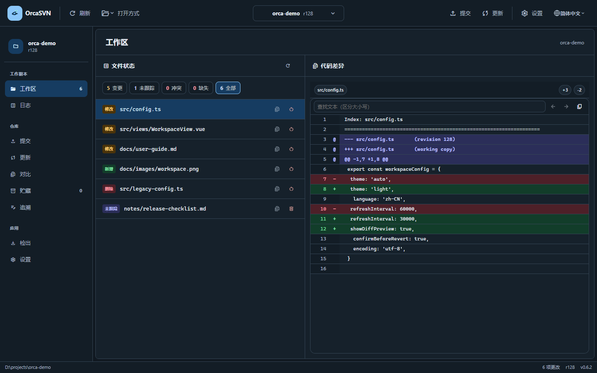

# OrcaSVN 用户手册

适用版本：OrcaSVN 0.6.4 正式版。更新日期：2026-10-09。较旧发行版可能与文中界面不同。

本手册面向使用 SVN 管理代码、文档和其他项目文件的用户。无需了解软件实现即可完成检出、审阅修改、提交、更新及查询历史。

## 目录

- [开始使用](#开始使用)
- [认识界面](#认识界面)
- [管理工作区](#管理工作区)
- [查看与处理文件状态](#查看与处理文件状态)
- [提交修改](#提交修改)
- [获取远端更新](#获取远端更新)
- [查看代码差异](#查看代码差异)
- [查询提交历史](#查询提交历史)
- [暂时保存修改：贮藏](#暂时保存修改贮藏)
- [逐行追溯](#逐行追溯)
- [设置与显示](#设置与显示)
- [常见问题](#常见问题)
- [功能边界](#功能边界)

## 开始使用

### 准备软件和 SVN

OrcaSVN 是 SVN 桌面客户端，需要本机已安装 SVN 命令行工具。软件本身不代替 SVN 服务端，也不创建远端仓库。

1. 从项目的 [发行下载页](https://github.com/wustites/OrcaSVN/releases) 选择适合操作系统的安装包。
2. 安装 SVN 命令行工具。在终端运行 `svn --version --quiet`，应输出版本号。
3. 启动 OrcaSVN。若找不到 SVN，进入“设置”，在“SVN 可执行文件”中填写实际程序路径，例如 `C:\Tools\Subversion\bin\svn.exe`。

路径应指向程序文件，而不是安装目录。留空时使用系统环境中的 `svn`。连接受限仓库前，准备好仓库地址及团队要求的访问权限；认证失败时按 SVN 错误信息检查凭据或联系仓库管理员。当前没有独立的账号管理页面。

### 已经有本地项目

点击“打开工作区”，选择已有 SVN 工作副本目录。通常这是含有 `.svn` 元数据的项目根目录，例如 `D:\projects\eagle`。普通文件夹不会因为被打开就自动成为 SVN 工作副本。

### 第一次取得项目

进入“检出”页面：

| 字段 | 如何填写 |
| --- | --- |
| 仓库 URL | 团队提供的地址，例如 `https://svn.example.com/repo/trunk` |
| 目标目录 | 本地保存项目的目录；建议使用专用的新目录 |
| 版本 | 留空取得最新版本，或输入需要检出的历史版本号 |

点击“开始检出”，等待输出结果。失败时先阅读错误信息，再检查地址、访问权限、网络和目标目录。检出是从仓库取得文件；打开工作区是使用已经检出的本地文件。

### 第一次修改并提交

1. 打开工作区，在“更新”页面检查并取得远端修改。
2. 使用编辑器修改项目文件。
3. 回到 OrcaSVN，点击“刷新”，在工作区选择文件查看差异。
4. 进入“提交”，核对勾选范围，填写提交说明。
5. 点击提交，成功后回到工作区确认剩余修改。

例如：只修复 `trunk/app.ini` 中的配置时，提交页只勾选这个文件，说明写为“修正默认连接超时时间”，其余尚未完成的修改留在本地。

## 认识界面

以下截图摄于 2026-10-02 的发布前开发阶段，在本地浏览器中使用示例工作区数据截取，尺寸为 1440 × 900。展示 0.6.3 的主要布局与主题；路径、版本号和代码差异均为示例。

浅色主题：左侧为导航，中间为文件状态，右侧显示选中文件的代码差异。


深色主题：相同工作区、相同文件与差异内容。



| 区域 | 用途 |
| --- | --- |
| 顶部工具栏 | 刷新、打开方式、工作区切换、提交、更新、设置和语言 |
| 侧边导航 | 工作区、日志、提交、更新、对比、贮藏、追溯、检出、设置 |
| 工作区文件列表 | 按状态筛选本地文件，选择文件查看差异 |
| 代码差异面板 | 显示选中文件的差异和增删统计 |
| 底部状态栏 | 显示当前工作区等状态信息 |

窗口较窄时，导航改为横向滚动。工作区文件列表和代码差异上下排列，可滚动查看。选择文件时使用背景高亮；键盘移动到按钮时会有独立的焦点提示。

## 管理工作区

通过顶部工作区切换器使用最近打开的路径。切换前核对当前目录，尤其是同一仓库的多个工作副本。工作副本之间的本地修改不会自动同步，只有提交到仓库后的内容才能通过更新取得。

“打开方式”提供资源管理器、VS Code 和终端入口。相应外部程序需在本机可用。工作区文件的右键菜单可在资源管理器中定位文件、复制相对路径或绝对路径。

### 刷新与缓存提示

“刷新”核对本地工作副本状态，不会把远端修改更新到本地，也不会提交修改。

再次打开工作区时，软件可能先显示之前保存的文件列表，再核对实际状态。出现缓存或未验证提示时，列表不一定反映当前磁盘内容；提交、创建贮藏以及工作区还原/删除暂时不可用。等待验证完成，或点击刷新。验证失败时应处理错误，不能把旧列表当作最新状态。

也可以打开工作副本中的子目录；刷新会同时核对所属工作副本的 SVN 管理状态。升级到 0.6.3 后，原生状态缓存会重新建立一次，首次打开可能需要完整扫描。

工作区加载时间取决于文件数量、磁盘、杀毒软件及文件系统状态等。提交历史条数与本地状态检查不是同一件事；仓库历史很多，不一定意味着本地加载同样慢。

## 查看与处理文件状态

| 状态 | 含义 | 下一步 |
| --- | --- | --- |
| 修改 | 已纳入版本控制的文件存在本地修改 | 审阅差异后提交、贮藏或还原 |
| 新增 | 已安排加入版本控制，但尚未提交 | 确认文件应进入仓库后提交 |
| 删除 | 已安排从版本控制中删除，尚未提交 | 核对删除范围后提交，或还原 |
| 替换 | 原条目被新的条目替换 | 检查完整操作范围 |
| 未跟踪 | 文件存在，但尚未纳入版本控制 | 在提交页加入版本控制，或保留在本地 |
| 冲突 | 修改不能自动合并 | 先解决内容并用支持的 SVN 工具标记解决，再刷新 |
| 缺失 | 受版本控制的文件在磁盘上不存在 | 恢复文件，或用 SVN 工具安排版本控制删除 |
| 阻塞 | 文件系统中的条目妨碍 SVN 操作 | 阅读 SVN 错误并检查路径、文件类型与工作副本状态 |

顶部分类帮助缩小列表；“变更”包含修改、新增、删除和替换，“未跟踪”独立显示。工作区列表不是所有项目文件的文件浏览器，正常且无修改的文件可能不在其中。

### 还原已纳入版本控制的文件

点击文件行的还原按钮，阅读警告及完整路径，再确认“还原”。还原丢弃该目标的本地修改，不会撤销已经提交到仓库的历史。需要保留修改时，先创建适用的贮藏或另外备份文件。

### 删除未跟踪文件

未跟踪文件行的删除按钮会永久删除本地目标；删除目录也会删除其中内容，不进入回收站。它与“把受控文件的删除提交到仓库”不同。确认框中核对路径，点击“取消”或关闭即可退出；点击遮罩不会关闭确认框。

## 提交修改

提交把勾选的本地变更发送到仓库，成功后生成新的仓库版本。没有勾选的修改继续留在工作副本。

### 选择范围

1. 进入“提交”，查看当前工作区路径与文件树。
2. 勾选需要提交的文件；勾选目录会联动其下可提交子项，也可逐项取消。
3. 使用搜索和分类过滤列表，检查顶部已选数量。
4. 审阅差异，返回提交页后核对勾选和说明。
5. 输入说明并提交。

搜索或筛选隐藏的已选文件仍计入提交，不会因为当前看不见就自动取消。提交前以已选总数和实际范围为准，避免带入无关修改。

### 新文件和新目录

未跟踪文件需要先加入版本控制。未跟踪目录通过“加入版本控制并预览”展开后，检查其内容再提交。加入版本控制只是安排新增，不等于已经提交到远端；若之后取消提交，仍需检查工作区中的新增状态。

### 目录操作的限制

删除或替换目录时，必须完整选择所需子项。复制或移动目录暂不支持部分提交；遇到相关提示，请用其他 SVN 客户端处理完整操作。不要为了通过提交检查而忽略提示中的目录关系。

### 提交说明

说明应回答“改了什么、为什么改”。例如：

```text
修复配置文件中默认超时时间错误

将默认值调整为团队约定值，避免首次连接过早超时。
```

页面提供最近提交说明，复用前应修改为适合本次内容的文字。提交失败时保留错误信息，并刷新确认当前状态；不要直接假定已经成功或完全没有产生变化。

## 获取远端更新

更新开始后可以切换到其他页面；操作完成时仍会刷新工作区的本地版本和变更列表。离开更新页后暂停自动远端查询，返回时恢复。

“更新”页面显示本地版本、远端版本、列出的远端提交以及本地更改。

1. 点击“检查”，审阅远端提交和本地更改。
2. 需要暂时保存本地工作时，先备份或贮藏支持的修改。
3. 点击“更新”，等待操作结束。
4. 回到工作区刷新，检查冲突和剩余修改。

“远端提交”数量是页面当前列出的记录数量，不应当作整个仓库历史总数。更新可能合并本地修改，也可能产生冲突；它不会自动提交你的本地工作。

## 查看代码差异

工作区选择文件可直接预览差异，也可进入“对比”页面，选择当前工作区内的文件。

| 模式 | 比较内容 |
| --- | --- |
| 工作副本 vs 基准 | 本地内容与 SVN 工作副本基准的差异 |
| 版本间差异 | 同一目标在旧版本、新版本之间的差异；两个版本号都要填写 |
| 提交 rN | 从日志详情进入，查看该次提交涉及的变化 |

新增行有 `+`，删除行有 `-`，上下文行帮助定位修改。行内查找区分大小写，使用上一个/下一个匹配定位；复制按钮复制完整 Diff。没有差异与加载失败是不同状态，应结合页面提示判断。

从提交页审阅多个文件时，可用“上一个”“下一个”切换，再点击“返回提交”。二进制内容不一定能显示逐行文本差异。

## 查询提交历史

进入“日志”，默认每页显示 20 条提交。使用上一页、下一页浏览；作者、关键词、日期范围可组合筛选，填写后点击“查询”，点击“重置”清除条件。

表格显示版本、作者、日期、提交信息等。长作者名和提交信息省略显示，悬停查看全文。点击记录打开详情，查看完整说明和涉及路径，再选择相关文件查看提交差异。

筛选结果为空时，先检查日期范围、作者和关键词，再重置条件。日志显示的是已提交历史，尚未提交的本地修改应在工作区查看。

## 暂时保存修改：贮藏

贮藏用于中断当前工作后再恢复，例如临时处理紧急任务。它保存在当前设备的软件本地数据中，按工作区路径区分，不是仓库提交，也不是团队共享备份。

### 创建

1. 打开“贮藏”，点击“创建贮藏”。
2. 查看文本差异，按文件或分块勾选要保存的修改。
3. 按整文件选择需要保存的未跟踪文件或目录。
4. 输入容易辨识的名称。
5. 点击“保存并从工作副本移除”。

选中的修改保存后从工作副本移除，未选中的修改留在原处。未跟踪文件恢复后仍保持未跟踪状态。受控文件的冲突、仅属性修改及非文本变更暂不支持按此方式贮藏；以实际可选择内容和提示为准。

### 恢复与管理

| 操作 | 结果 |
| --- | --- |
| 应用 | 将内容恢复到原工作区，保留贮藏记录 |
| 弹出并删除 | 应用成功后删除贮藏记录 |
| 删除 | 只删除贮藏记录，不修改当前工作副本 |
| 复制 patch / 导出 patch 文件 | 复制或导出文本补丁部分 |

patch 导出不包含贮藏中另存的未跟踪文件内容；仅有未跟踪文件时可能没有可导出的 patch。需要迁移或备份这些文件时，应另行保存完整文件。

若提示“贮藏已保存，但未能从工作副本移除改动”，记录已保留，先刷新检查实际残留。应用失败时也应检查工作区，不要连续重复应用。清除软件本地数据可能使贮藏记录丢失；重要工作应提交或做独立备份。

## 逐行追溯

在“追溯”页面选择或输入文件，点击“加载”。表格显示行号、最后修改版本、作者和内容，用于定位某一行的历史来源，再结合日志理解修改原因。

追溯反映版本控制历史，不等同于当前尚未提交修改的作者归属。查看本地修改请使用工作区和差异页面。

## 设置与显示

| 设置 | 说明 |
| --- | --- |
| 语言 | 简体中文、繁体中文、英语、日语、韩语；顶部也有语言入口 |
| 主题 | 浅色、深色、自动；自动跟随系统外观 |
| SVN 可执行文件 | 留空使用系统 `svn`，或填写实际程序路径 |
| 默认编码 | UTF-8、GBK、GB2312；用于相关内容解码，不会自动改写项目文件编码 |
| 忽略文件（.gitignore） | 启用后过滤匹配项；默认关闭 |

`.gitignore` 过滤是界面过滤，不会自动设置 SVN 的忽略属性，也不会把受控文件移出仓库。找不到预期文件时，可关闭过滤并刷新核对。

系统开启减少动态效果时，界面会减少动画，加载文字仍然显示。工作区文件按钮可通过 Tab 获得焦点，用方向键、Home、End 移动；Enter 激活当前按钮。软件没有在本手册中承诺额外的全局快捷键。

## 常见问题

| 问题 | 建议处理 |
| --- | --- |
| 找不到 SVN | 在终端验证 `svn`，检查设置中的程序路径；环境变更后重新启动软件 |
| 目录不是工作副本 | 选择正确的 `.svn` 工作副本根目录，或先检出项目 |
| 提交、贮藏或还原按钮不可用 | 检查缓存验证提示、是否已有操作进行、是否选择了可操作内容 |
| 新文件不在变更分类中 | 查看未跟踪分类；需要提交时在提交页加入版本控制 |
| 列表缺少文件 | 检查状态筛选及 `.gitignore` 过滤，刷新核对；正常文件可能不列出 |
| 更新后出现冲突 | 审阅文件、解决冲突并用适合的 SVN 工具标记解决，再刷新 |
| 工作副本被锁定 | 若没有其他 SVN 操作正在进行，可使用工作区的 Cleanup 入口；持续失败时按 SVN 错误处理 |
| 登录、证书或网络错误 | 核对地址、访问权限、网络及团队的证书配置；保留 SVN 原始错误 |
| 贮藏看不见 | 确认回到创建时的工作区路径；记录不会自动跟随移动后的路径 |
| 乱码 | 检查文件实际编码及默认编码；不要用还原来试图修复显示乱码 |
| 删除或还原后想找回 | 未提交修改可能无法通过 SVN 恢复；检查独立备份或编辑器历史 |

反馈问题时提供：软件版本、操作系统、具体步骤、预期与实际结果、完整错误文字；必要时附截图。对外提交前移除密码、令牌以及不适合公开的仓库地址和文件内容。可通过项目 [问题反馈页](https://github.com/wustites/OrcaSVN/issues) 报告。

## 功能边界

当前主要界面入口涵盖检出、状态查看、部分提交、更新、差异、日志、贮藏、追溯和设置。项目底层能力不代表已经提供完整用户界面：切换仓库 URL（Switch）、合并（Merge）、标记冲突解决（Resolve）、受控文件安排删除等操作，当前应使用其他 SVN 客户端或命令行完成，再回到 OrcaSVN 刷新。

SVN 的基准、本地修改和仓库历史是不同层次：刷新核对本地状态，更新取得远端内容，提交发送本地变更，还原丢弃本地修改，贮藏在本机暂存工作。选择操作前先确认你要改变哪一层。

只需要入门步骤时，参阅[快速使用](../QUICKSTART.md)。
